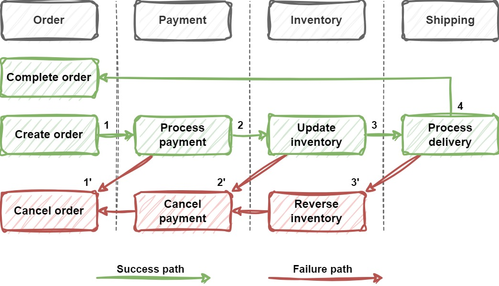

# SagaSeminar

## 1. Introduction
This project is built for demonstrating the usage of Saga pattern in a distributed software system.

Seminar video: https://youtu.be/s8p2SSCjw9g

Overview structure:
+ `Resources`: 
  + Presentation slide and medias
  + The seminar slide is [Saga Seminar.pdf](/Resources/Saga%20Seminar.pdf)
+ `Others`: source code related files

## 2. Installation
### a. Requirements
+ .NET SDK 6.0
+ Docker Desktop
### b. Installation steps

To debug locally
1. At the solution folder, run docker cmd `docker-compose up -d`
2. Wait about 1 minute for initialization
3. Set solution startup projects: 
   + `SagaSeminar`
   + `SagaSeminar.Clients.WebClient`
   + `SagaSeminar.Services.InventoryService`
   + `SagaSeminar.Services.OrderService`
   + `SagaSeminar.Services.PaymentService`
   + `SagaSeminar.Services.ShippingService`.
4. Start (with or without debug) the projects 

To start the whole system
1. At the solution folder, run docker cmd `docker-compose -f ./docker-compose-app.yml up -d`
2. Wait about 1 minute for initialization
3. Access page `http://localhost:10000` on your browser

## 3. Important sections

### Business projects
+ `SagaSeminar`: Global service
  + `Entities`: transaction-related entities
  + `Services`
    + `OrderProcessingOrchestrator.cs`: the orchestrator to handle order processing transaction by listening to business events and coordinating different saga transactions by sending commands 
    + `OrderProcessingReplayOrchestrator.cs`: like `OrderProcessingOrchestrator.cs` but uses "Replay" technique  
    + `TransactionService.cs`: manage/persist transactions data
  + Miscellaneous

+ `SagaSeminar.Services.{Domain}Service`: the domain specific service (API)
  + `Entities`: domain related entities
  + `Services`
    + `{Domain}ChoreographySaga`: the choreography saga service that listens to business events then process them directly using services
    + `{Domain}OrchestratorSaga`: the orchestrator saga service that listens to business commands then process them using services
    + `{Domain}Service`: the service classes that handle main application use cases

+ `SagaSeminar.Clients.WebClient`: the Blazor web assembly for UI single-page application

### Infrastructure
+ Other projects: implementations for infrastructure services such as SqlServer, Kafka, Redis, SignalR, etc
+ Shared projects: shared implementations, models, utilities across projects

### Notes
+ Practically, events should be solid and compact, e.g, `OrderCreatedEvent` should only contains the `OrderId`, `TransactionId`,..., then event consumers should read the actual data from data sources (API calls/DB access). It shouldn't contain the whole `OrderModel` since doing this will take more data storage and easily cause outdated data to be processed, for example, the order was cancelled by admin but still being processed by the saga.
+ This project puts the whole model into events for brevity and demo purposes only.

## 4. Usage guides
### Overview

Application flow

This system allows you to:
+ Create order: the order processing flow will be handled by the saga participants 
+ View the data via the pages displayed in the left side bar
+ View the real-time logs to understand what's happening under the hood
+ Simulate failures at different stages
+ View the recorded transactions and their detailed states

### Pages' description:
1. `Home`: show real-time logs from sub-systems, different log's colors represent different services
2. `Orders`: List of orders 
   `Create order`: Create new order
3. `Payments`: List of payments
4. `Inventory`: List of inventory notes: show records of inventory update
   + Positive (+): inventory receipt
   + Negative (-): inventory delivery
5. `Deliveries`: List of deliveries (shipments)
6. `Transactions`: List of transactions recorded by the Orchestrator 
   `Transaction details`: by clicking on the transaction ID, details page will show. 
   + Details page show the status of selected transaction and its list of saga transactions from different services/participants. 
   + For retryable transcation, e.g, `CompleteOrder`, you can click on `Retry` button to trigger running that transaction again.
   
   **Note**: transactions will only be recorded when using orchestrator saga mode (see `Global Config` page)
7. `Global Config`: configure options to manipulate the bahavior of the systems (for demo purposes only).
   + `Delay (ms)`: delay time before actually performing an action, e.g, create order, process payment, etc.
   + `Should create order fail`: if turned on, create order action will always fail.
   + `Should process payment fail`: if turned on, process payment action will always fail.
   + `Should inventory delivery fail`: if turned on, inventory delivery action will always fail.
   + `Should delivery fail`: if turned on, final delivery action will always fail.
   + `Complete order retry count`: number of tries that the complete order action should perform. The action will always fail if it exceeds 5 tries.
   + `Use orchestrator saga`: 
     + If turned on, orchestrator saga will be used.
     + If turned off, choreography saga will be used.
   + `Use replay technique`: 
     + If turned on, replay saga will be used (if `Use orchestrator saga` is turned on).
   + `Should reset data`: if turned on, data (SqlServer, Kafka) will be reset after restarting the system.

## 5. Disclaimer
This project is just for demo purposes. It shows how the Saga pattern gets applied in a micro-services like system. The project structure is not yet a standard or best practice to follow. Please use it as a reference only.
